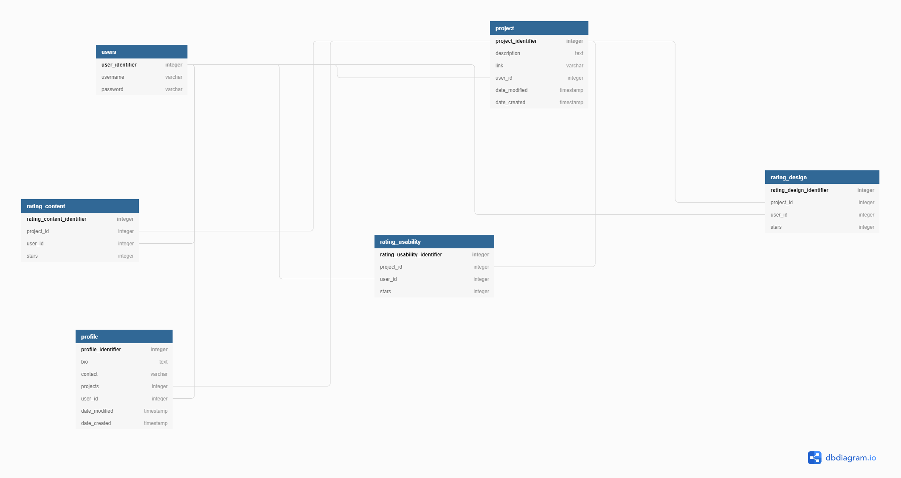

#  Awards App.
This is a web api that allows users to post their projects and have them voted for. The project has a backend api built using Django Rest Framework.

## Demo and documentation

- The demo link is: [demo](https://youtu.be/GfOlsq77XAM)
- Documentation: [docs](https://documenter.getpostman.com/view/10693271/2s93RL2H1a)

###  Prerequisites and Installing
You need to install the following software/technologies to have the app running on your local machine for development and testing purposes. Instructions on how to install will also be provided next to the software.

|Software|Installation Instructions/Terminal Commands|
|----------|---------------------------|
|Python3.8|1. sudo apt-get update|
|  |         2. sudo apt-get install python3.8|
|Virtual Environment|1. Python3 -m venv virtual|
|   |2. Activate by running: ource virtual/bin/activate|
|Pip|pip install --upgrade pip|
|Django 4.1.7 |pip install Django|
|django rest framework|pip install djangorestframework|

##  Built With

*  [Django] - 4.1.7 (https://docs.djangoproject.com/en/4.1/)

##  Contributing

Please read [CONTRIBUTING.md](https://gist.github.com/PurpleBooth/b24679402957c63ec426) for details on our code of conduct, and the process for submitting pull requests to us.

##  Authors

* **Wendy Munyasi**

##  License

This project is licensed under the MIT License.

## DB Diagram

## Api Link and description

**Postman** can be used to access the api routes as the token identifier is provided directly.

## Project-Setup Instructions.

1.Open your github account and search for github username: **wendymunyasi**

1. git clone using the following links.

   link: https://github.com/wendymunyasi/awards-api.git

2. For Django app, set the database to your own url then run `python3 manage.py makemigrations` and `python3 manage.py migrate`.
3. Run the command `python3 manage.py runserver`.
4. Click the local host link on your terminal  and navigate to the api root.

## NOTE

Almost every action is documented on the console, from posting a project o rating a project. For curiouser and curiouser, open your console and view what messages display when you perform an action.

## Collaborate

To colloborate, reach me through my email address wendymunyasi@gmail.com
